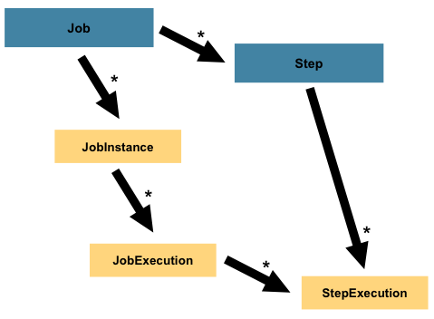

# Spring Batch 入门

## 概述

spring batch 是一个轻量级的，完善的批处理框架，是 spring 的一个子项目。

spring batch 提供了大量可重用的组件，包括日志、追踪、事务、任务作业统计、任务重启、跳过、重复、资源管理。对于大数据量和高性能的批处理任务，spring batch 同样提供了高级功能和特性来支持，比如分区功能，远程功能，通过 spring batch 能够支持简单的，复杂的和海量的批处理作业

spring batch 是一个批处理应用框架，不是调度框架，但需要和调度框架合作来构建完成批处理任务。它只关注批处理任务相关的问题，例如事务、并发、监控、执行等，并不提供相应的调度功能。如果需要使用调度框架，在商业和开源软件中已经有很多优秀的企业级调度框架，例如 Quartz, Tivoli, Control-M, Cron 等可以使用

spring batch 主要有以下功能：

1. Transaction managment (事务管理)
2. Chunk based processing (基于块的处理)
3. Declarative I/O (声明式IO)
4. Start/Stop/Restart
5. Retry/Skip

框架主要有 4 个角色:

1. JobLauncher: 任务启动器，通过它来启动任务，可以看做是程序的入口
2. Job：代表一个具体的任务
3. Step：代表一个具体的步骤，一个 Job 可以有多个 Step
4. JobRepository：存储数据的地方，可以看做一个数据库的接口，在任务执行时需要通过它来记录任务状态等

## 核心 Api

> JobInstance: 和 Job 的关系就像是"实例与类的关系"，Job 定义了一个工作流程，JobInstance 就是该流程的一个实例，
>
> 一个 Job 可以有多个 JobInstance
>
> 
>
> JobParameters：是一组可以贯穿整个 Job 的运行时配置参数。不同的配置将产生不同的 JobInstance，用于区分 JobInstance
>
> 
>
>
> JobExecution：表示 JobInstance 的一次运行，JobInstance 运行时可能会成功或失败，例如，如果 JobInstance 运行失败重试
>
> 那么会产生一个新的 JobExecution
>
> 
>
> StepExecution：类似 JobExecution，表示 Step 的一次运行，Step 是 Job 的一部分，因此 StepExecution 会关联到一个 JobExecution
>
> 
>
> ExecutionContext：由框架管理的一个容器，框架会对该容器持久化，开发人员可以用该容器保存一些数据，
>
> 以支持 Job 或者 Step 来共享这些数据

